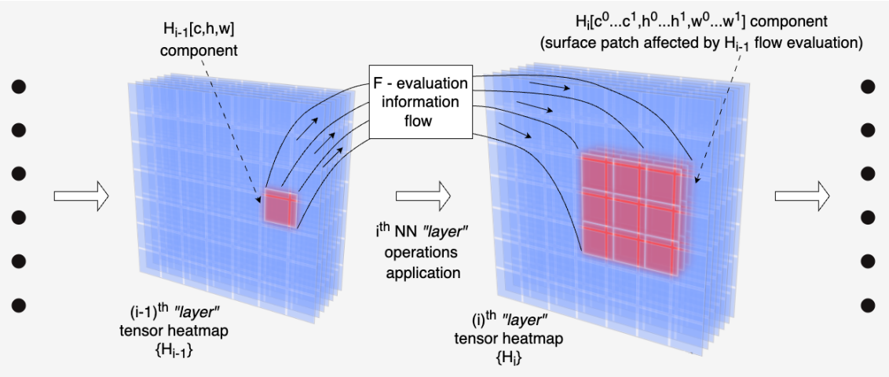
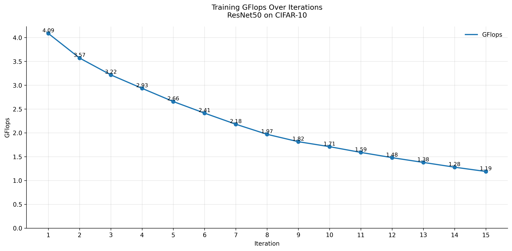
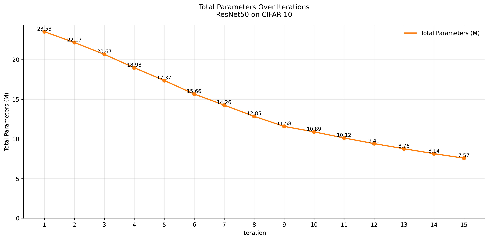
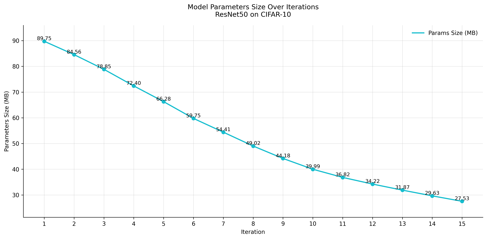
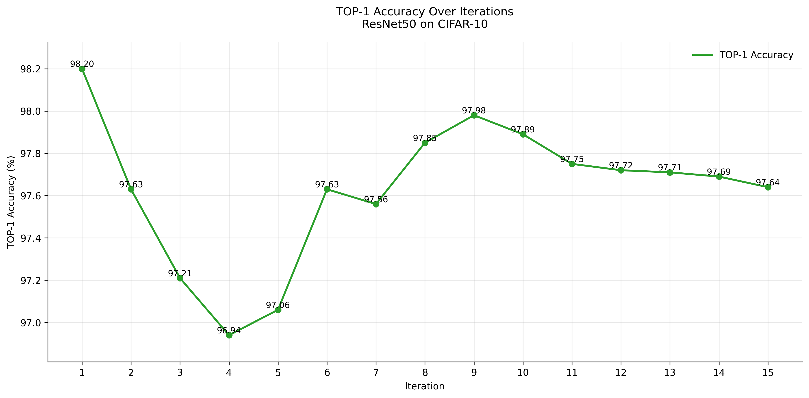
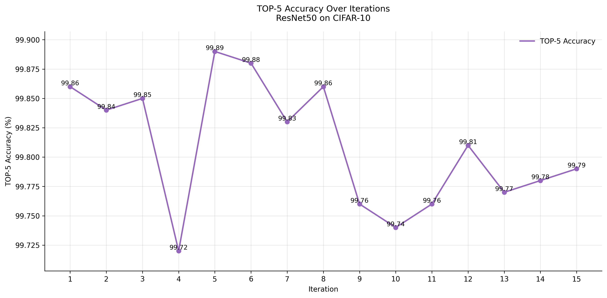
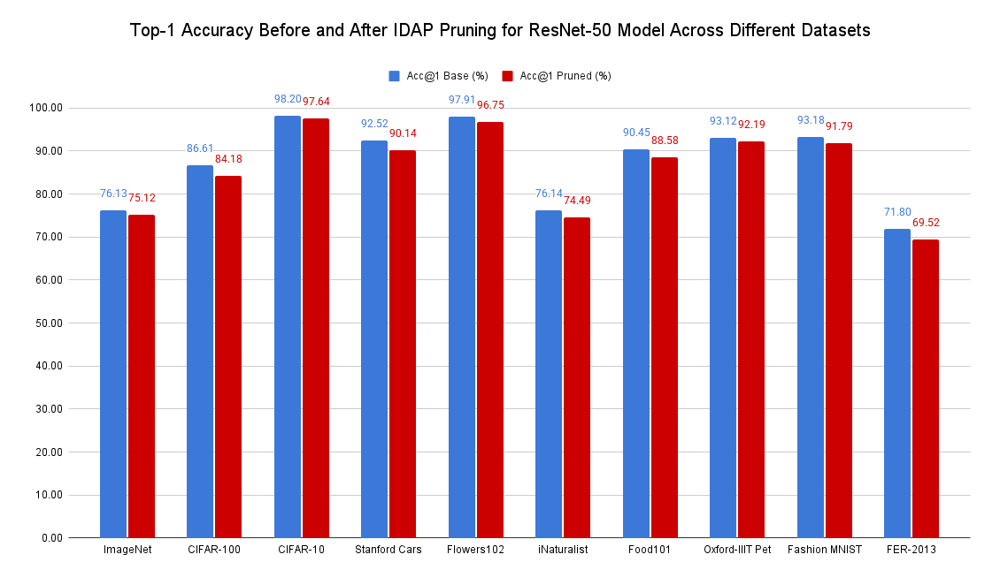

# Posterior Evaluation Operation Quantity Reduction Technique via Layer-to-Layer Heatmap Divergence Analysis

### Description
This repository contains the implementation and experimental results for our submission to The 40th Annual AAAI Conference on Artificial Intelligence (AAAI 2026) conference. The project introduces an innovative approach to analyzing and optimizing deep neural network through tensor flow analysis. By measuring the divergence between intermediate tensors, we develop a framework for understanding information propagation and identifying redundant computations within the network. Our methodology enables efficient network optimization through intelligent parameter pruning, resulting in reduced computational complexity and faster inference times while preserving model accuracy. This work provides a systematic approach to enhancing the efficiency of deep encoders, particularly valuable for applications with limited computational resources.


### DNN evaluation flow concept illustration



### Algorithms

A detailed examination of the algorithmic steps for calculating the divergence in fully connected layers is provided below.

---

#### **Algorithm 1: Flow Divergence Computation for FC Networks**

---

**Require:** Input sample $x$, network parameters $\{{W_l, b_l\}}_{l=1}^{L}$  
**Ensure:** Total divergence $D_{FC}$

Initialize $D_{FC} \leftarrow 0$  
$h_0 \leftarrow x$        {Set input}  
for $l \leftarrow 1$ to $L$ do  
&nbsp;&nbsp;&nbsp;&nbsp;$z_l \leftarrow W_l h_{l−1} + b_l$  {Pre-activation}  
&nbsp;&nbsp;&nbsp;&nbsp;$h_l \leftarrow \sigma(z_l)$      {Activation}  
&nbsp;&nbsp;&nbsp;&nbsp;$\delta_l \leftarrow \|h_l\|_2 \cdot \|W_l\|_F$ {Layer divergence}  
&nbsp;&nbsp;&nbsp;&nbsp;$D_{FC} \leftarrow D_{FC} + \delta_l$  
end for  
return $D_{FC}=0$

---

Furthermore, we provide complexity estimates for the proposed procedure for calculating the divergence of the flow through the fully connected layers of the neural network.  

The algorithm requires:

- $O(∑_{l=1}^{L} n_l n_{l−1})$ time (matrix-vector multiplications),
- $O(∑_{l=1}^{L} n_l)$ space (storing activations).

It is also worth noting some notable properties of the definition and procedure for calculating the divergence flow for fully connected networks:

1. For ReLU networks, the divergence simplifies to:  
$ \phi = \| h_l \leftarrow \max(0, z_l) \|_2 \cdot \| W_l \|_F. $

2. The weight matrix norm $\|W_l\|_F$ acts as an importance weighting factor.

---

We also provide a detailed examination of the algorithm for calculating the divergence in convolutional networks.

---

#### **Algorithm 2: Flow Divergence Computation for Convolutional Networks**

---

**Require:** Input tensor $X$, conv parameters $\{{W_l, b_l}\}_{l=1}^{L}$  
**Ensure:** Total divergence $D_{conv}$

Initialize $D_{conv} \leftarrow 0$  
$A_0 \leftarrow X$        {Set input}  
for $l \leftarrow 1$ to $L$ do  
&nbsp;&nbsp;&nbsp;&nbsp;$Z_l \leftarrow W_l A_{l−1} + b_l$  {Convolutional operation}  
&nbsp;&nbsp;&nbsp;&nbsp;$A_l \leftarrow \sigma(Z_l)$      {Activation}  
&nbsp;&nbsp;&nbsp;&nbsp;Compute spatial dimensions $H_l$, $W_l$, $C_l$ of $A_l$  
&nbsp;&nbsp;&nbsp;&nbsp;$\delta_l \leftarrow \frac{1}{{H_l}{W_l}{C_l}} \|A_l\|_F \cdot \|W_l\|_F$  
&nbsp;&nbsp;&nbsp;&nbsp;$D_{conv} \leftarrow D_{conv} + \delta_l$  
end for  
return $D_{conv}=0$

---

Now let us give the complexity estimation:  
• $O(∑_{l=1}^{L} H_l W_l C_l C_{l−1} k^2)$ time (convolution operations),  
• $O(∑_{l=1}^{L} H_l W_l C_l)$ space (activation storage).  
Finally, we have to denote a group of remarkable aspects.  
• For strided convolutions, adjust spatial dimensions accordingly.  
• Batch normalization can be incorporated by modifying the $Z_l$ computation.  
• For pooling layers, include them in the computational path but set $ϕ = 0$ (no parameters).  

---

We formalize the algorithm for calculating divergence in the case of self-attention layers and non-local blocks.

---

#### **Algorithm 3: Flow Divergence Computation for Self-Attention Layers**

---

**Require:** Input sequence $X \in \R^{n \times d_{model}}$, attention parameters $\{{W_Q^h, W_K^h, W_V^h}\}_{h=1}^{H}$  
**Ensure:** Total divergence $D_{attn}$

Initialize $D_{attn} \leftarrow 0$  
for $h \leftarrow 1$ to $H$ do  
&nbsp;&nbsp;&nbsp;&nbsp;$Q^h \leftarrow XW_Q^h$              {Query projection}  
&nbsp;&nbsp;&nbsp;&nbsp;$K^h \leftarrow XW_K^h$              {Key projection}  
&nbsp;&nbsp;&nbsp;&nbsp;$V^h \leftarrow XW_V^h$              {Value projection}  
&nbsp;&nbsp;&nbsp;&nbsp;$S^h \leftarrow softmax(\frac{Q^h(K^h)^T}{\sqrt{d_k}})$        {Attention scores}  
&nbsp;&nbsp;&nbsp;&nbsp;$O^h \leftarrow S^hV^h$              {Attention output}  
&nbsp;&nbsp;&nbsp;&nbsp;$\delta_h \leftarrow \frac{1}{n} \|A^h\|_F \cdot (\|W_Q^h\|_F+\|W_K^h\|_F+\|W_V^h\|_F)$  
&nbsp;&nbsp;&nbsp;&nbsp;$D_{attn} \leftarrow D_{attn} + \delta_h$  
end for  
return $D_{attn}=0$

---

The presented algorithm requires:   
• $O(Hn^2d_k+Hnd_v^2)$ time (attention computation),  
• $O(Hnd_v)$ space (attention outputs storage).  
Also, we should note some features of the divergence calculation in such layers and blocks.  
1. For multi-head attention, we have to compute divergence separately for each head.
2. Layer normalization can be incorporated by normalizing inputs.
3. Residual connections should be accounted for in the divergence measure.
4. The divergence captures both attention pattern changes and value transformations.
5. For transformer blocks, combine with FFN divergence:  
$D_{block} = D_{attn} + D_{ffn}$

---


### Results

1. The table below presents the results of our computer vision (CV) experiments, comparing model performance before and after pruning across different architectures and datasets. We report top-1 accuracy (Acc@1) for both baseline and pruned models, along with their computational costs in GFlops. The Δ% columns quantify the relative changes in accuracy and computational efficiency post-pruning.


<table border="2" cellspacing="0" cellpadding="5" cellspacing="0" style="border-collapse: collapse; width: 100%; text-align: center;">
    <caption style="caption-side: top; font-weight: bold; padding: 8px;">
        Comparative Analysis of Pruning Techniques Across CV Architectures
    </caption>
    <thead>
        <tr>
            <th style="text-align: center;">Architecture</th>
            <th style="text-align: center;">Dataset</th>
            <th style="text-align: center;">Acc@1 Base</th>
            <th style="text-align: center;">Acc@1 Pruned</th>
            <th style="text-align: center;">∆%</th>
            <th style="text-align: center;">GFlops Base</th>
            <th style="text-align: center;">GFlops Pruned</th>
            <th style="text-align: center;">∆%</th>
        </tr>
    </thead>
    <tbody>
        <tr><td rowspan="10">ResNet-50</td><td>ImageNet</td><td>76.13</td><td>75.12</td><td>-1.33</td><td>4.1</td><td>1.5</td><td>-63</td></tr>
        <tr><td>CIFAR-100</td><td>86.61</td><td>84.18</td><td>-2.81</td><td>4.1</td><td>1.2</td><td>-71</td></tr>
        <tr><td>CIFAR-10</td><td>98.20</td><td>97.64</td><td>-0.57</td><td>4.1</td><td>1.2</td><td>-71</td></tr>
        <tr><td>Stanford Cars</td><td>92.52</td><td>90.14</td><td>-2.57</td><td>4.1</td><td>1.2</td><td>-71</td></tr>
        <tr><td>Flowers-102</td><td>97.91</td><td>96.75</td><td>-1.18</td><td>4.1</td><td>1.5</td><td>-63</td></tr>
        <tr><td>iNaturalist</td><td>76.14</td><td>74.49</td><td>-2.17</td><td>4.1</td><td>1.4</td><td>-66</td></tr>
        <tr><td>Food101</td><td>90.45</td><td>88.58</td><td>-2.07</td><td>4.1</td><td>1.3</td><td>-68</td></tr>
        <tr><td>Oxford-IIIT Pet</td><td>93.12</td><td>92.19</td><td>-1.00</td><td>4.1</td><td>1.4</td><td>-66</td></tr>
        <tr><td>Fashion MNIST</td><td>93.18</td><td>91.79</td><td>-1.49</td><td>4.1</td><td>0.8</td><td>-80</td></tr>
        <tr><td>FER2013</td><td>71.80</td><td>69.52</td><td>-3.18</td><td>4.1</td><td>1.3</td><td>-68</td></tr>
        <tr><td rowspan="10">ViT-Base/16</td><td>ImageNet</td><td>81.07</td><td>79.49</td><td>-1.95</td><td>17.5</td><td>6.3</td><td>-64</td></tr>
        <tr><td>CIFAR-100</td><td>93.75</td><td>91.63</td><td>-2.26</td><td>17.5</td><td>5.8</td><td>-67</td></tr>
        <tr><td>CIFAR-10</td><td>98.61</td><td>96.94</td><td>-1.69</td><td>17.5</td><td>4.3</td><td>-75</td></tr>
        <tr><td>Stanford Cars</td><td>93.74</td><td>91.05</td><td>-2.87</td><td>17.5</td><td>5.1</td><td>-71</td></tr>
        <tr><td>Flowers-102</td><td>95.53</td><td>94.56</td><td>-1.02</td><td>17.5</td><td>5.5</td><td>-69</td></tr>
        <tr><td>iNaturalist</td><td>68.65</td><td>67.16</td><td>-2.17</td><td>17.5</td><td>6.8</td><td>-61</td></tr>
        <tr><td>Food101</td><td>87.41</td><td>85.00</td><td>-2.76</td><td>17.5</td><td>6.5</td><td>-63</td></tr>
        <tr><td>Oxford-IIIT Pet</td><td>89.57</td><td>87.32</td><td>-2.51</td><td>17.5</td><td>4.9</td><td>-72</td></tr>
        <tr><td>Fashion MNIST</td><td>92.83</td><td>90.81</td><td>-2.18</td><td>17.5</td><td>6.5</td><td>-63</td></tr>
        <tr><td>FER2013</td><td>70.21</td><td>67.95</td><td>-3.22</td><td>17.5</td><td>6.0</td><td>-66</td></tr>
        <tr><td rowspan="10">DenseNet-121</td><td>ImageNet</td><td>74.65</td><td>73.84</td><td>-1.09</td><td>2.8</td><td>0.9</td><td>-68</td></tr>
        <tr><td>CIFAR-100</td><td>72.07</td><td>70.11</td><td>-2.72</td><td>2.8</td><td>0.9</td><td>-68</td></tr>
        <tr><td>CIFAR-10</td><td>94.21</td><td>92.84</td><td>-1.45</td><td>2.8</td><td>0.7</td><td>-75</td></tr>
        <tr><td>Stanford Cars</td><td>83.14</td><td>81.06</td><td>-2.50</td><td>2.8</td><td>0.9</td><td>-68</td></tr>
        <tr><td>Flowers-102</td><td>91.03</td><td>88.75</td><td>-2.50</td><td>2.8</td><td>0.8</td><td>-71</td></tr>
        <tr><td>iNaturalist</td><td>69.74</td><td>67.94</td><td>-2.58</td><td>2.8</td><td>0.8</td><td>-71</td></tr>
        <tr><td>Food101</td><td>87.34</td><td>84.87</td><td>-2.83</td><td>2.8</td><td>0.8</td><td>-71</td></tr>
        <tr><td>Oxford-IIIT Pet</td><td>85.23</td><td>83.59</td><td>-1.92</td><td>2.8</td><td>0.7</td><td>-75</td></tr>
        <tr><td>Fashion MNIST</td><td>93.01</td><td>90.88</td><td>-2.29</td><td>2.8</td><td>0.9</td><td>-68</td></tr>
        <tr><td>FER2013</td><td>65.13</td><td>63.13</td><td>-3.07</td><td>2.8</td><td>0.8</td><td>-71</td></tr>
    </tbody>
</table>


2. The table below presents a comparative analysis of pruning techniques applied to various NLP architectures (BERT Base, T5 Base, and GPT-2 Base) across multiple benchmark datasets. For each model, we report the performance before and after pruning, along with the corresponding parameter reductions.

<table border="2" cellpadding="5" style="border-collapse: collapse; width: 100%; text-align: center;">
    <caption style="caption-side: top; font-weight: bold; padding: 8px;">
        Comparative Analysis of Pruning Techniques Across NLP Architectures
    </caption>
    <thead>
        <tr>
            <th style="text-align: center;">Architecture</th>
            <th style="text-align: center;">Dataset</th>
            <th style="text-align: center;">Metric</th>
            <th style="text-align: center;">Base Score</th>
            <th style="text-align: center;">Pruned Score</th>
            <th style="text-align: center;">∆%</th>
            <th style="text-align: center;">Base Params (M)</th>
            <th style="text-align: center;">Pruned Params (M)</th>
            <th style="text-align: center;">∆%</th>
        </tr>
    </thead>
    <tbody>
        <tr><td rowspan="10">BERT Base</td><td>SST-2</td><td>Accuracy</td><td>93.51</td><td>91.42</td><td>-2.2</td><td>110</td><td>35</td><td>-68</td></tr>
        <tr><td>MRPC</td><td>F1</td><td>89.34</td><td>86.70</td><td>-3.0</td><td>110</td><td>42</td><td>-62</td></tr>
        <tr><td>QQP</td><td>Accuracy</td><td>91.15</td><td>89.12</td><td>-2.2</td><td>110</td><td>45</td><td>-59</td></tr>
        <tr><td>RTE</td><td>Accuracy</td><td>66.81</td><td>63.11</td><td>-5.5</td><td>110</td><td>39</td><td>-65</td></tr>
        <tr><td>QNLI</td><td>Accuracy</td><td>91.43</td><td>89.12</td><td>-2.5</td><td>110</td><td>38</td><td>-66</td></tr>
        <tr><td>SQuAD 1.1</td><td>F1</td><td>88.12</td><td>85.64</td><td>-2.8</td><td>110</td><td>35</td><td>-69</td></tr>
        <tr><td>MNLI-m</td><td>Accuracy</td><td>84.51</td><td>82.50</td><td>-2.4</td><td>110</td><td>37</td><td>-67</td></tr>
        <tr><td>CoLA</td><td>MCC</td><td>52.14</td><td>46.99</td><td>-9.9</td><td>110</td><td>40</td><td>-64</td></tr>
        <tr><td>STS-B</td><td>Pearson</td><td>91.22</td><td>88.39</td><td>-3.1</td><td>110</td><td>43</td><td>-61</td></tr>
        <tr><td>ReCoRD</td><td>Accuracy</td><td>75.11</td><td>71.05</td><td>-5.4</td><td>110</td><td>38</td><td>-65</td></tr>
        <tr><td rowspan="10">T5 Base</td><td>SST-2</td><td>Accuracy</td><td>95.20</td><td>93.65</td><td>-1.6</td><td>220</td><td>68</td><td>-69</td></tr>
        <tr><td>MRPC</td><td>F1</td><td>90.71</td><td>87.82</td><td>-3.2</td><td>220</td><td>93</td><td>-58</td></tr>
        <tr><td>QQP</td><td>Accuracy</td><td>92.40</td><td>89.51</td><td>-3.1</td><td>220</td><td>89</td><td>-60</td></tr>
        <tr><td>RTE</td><td>Accuracy</td><td>80.12</td><td>76.04</td><td>-5.1</td><td>220</td><td>80</td><td>-64</td></tr>
        <tr><td>QNLI</td><td>Accuracy</td><td>93.72</td><td>91.83</td><td>-2.0</td><td>220</td><td>79</td><td>-64</td></tr>
        <tr><td>SQuAD 1.1</td><td>F1</td><td>92.08</td><td>89.01</td><td>-3.3</td><td>220</td><td>67</td><td>-69</td></tr>
        <tr><td>MNLI-m</td><td>Accuracy</td><td>87.11</td><td>83.71</td><td>-3.9</td><td>220</td><td>71</td><td>-68</td></tr>
        <tr><td>CoLA</td><td>MCC</td><td>51.14</td><td>46.24</td><td>-9.6</td><td>220</td><td>80</td><td>-64</td></tr>
        <tr><td>STS-B</td><td>Pearson</td><td>89.42</td><td>87.01</td><td>-2.7</td><td>220</td><td>89</td><td>-60</td></tr>
        <tr><td>ReCoRD</td><td>Accuracy</td><td>74.29</td><td>69.82</td><td>-6.0</td><td>220</td><td>79</td><td>-64</td></tr>
        <tr><td rowspan="10">GPT-2 Base</td><td>SST-2</td><td>Accuracy</td><td>92.05</td><td>90.62</td><td>-1.6</td><td>117</td><td>36</td><td>-69</td></tr>
        <tr><td>MRPC</td><td>F1</td><td>88.12</td><td>84.32</td><td>-4.3</td><td>117</td><td>45</td><td>-61</td></tr>
        <tr><td>QQP</td><td>Accuracy</td><td>90.04</td><td>86.24</td><td>-4.2</td><td>117</td><td>47</td><td>-60</td></tr>
        <tr><td>RTE</td><td>Accuracy</td><td>64.92</td><td>59.81</td><td>-7.9</td><td>117</td><td>42</td><td>-64</td></tr>
        <tr><td>QNLI</td><td>Accuracy</td><td>90.10</td><td>87.01</td><td>-3.4</td><td>117</td><td>41</td><td>-65</td></tr>
        <tr><td>SQuAD 1.1</td><td>F1</td><td>86.34</td><td>82.61</td><td>-4.3</td><td>117</td><td>36</td><td>-69</td></tr>
        <tr><td>MNLI-m</td><td>Accuracy</td><td>82.31</td><td>79.04</td><td>-4.0</td><td>117</td><td>39</td><td>-67</td></tr>
        <tr><td>CoLA</td><td>MCC</td><td>48.92</td><td>43.63</td><td>-10.8</td><td>117</td><td>40</td><td>-66</td></tr>
        <tr><td>STS-B</td><td>Pearson</td><td>89.82</td><td>86.47</td><td>-3.7</td><td>117</td><td>48</td><td>-59</td></tr>
        <tr><td>ReCoRD</td><td>Accuracy</td><td>73.01</td><td>68.92</td><td>-5.6</td><td>117</td><td>42</td><td>-64</td></tr>
    </tbody>
</table>


3. The next table presents a comparison of pruning methods across vision and NLP models. We report baseline results along with the performance of various pruning approaches. For each dataset, the best pruned performance is highlighted in <b>bold</b>.

<table border="2" cellpadding="5" style="border-collapse: collapse; width: 100%; text-align: center;">
    <caption style="caption-side: top; font-weight: bold; padding: 8px;">
        Comparison of Pruning Methods on Vision and NLP Benchmarks under 50-80% Sparsity
    </caption>
    <thead>
        <tr>
            <th style="text-align: center;">Model</th>
            <th style="text-align: center;">Method</th>
            <th style="text-align: center;">ImageNet</th>
            <th style="text-align: center;">CIFAR-10</th>
            <th style="text-align: center;">CIFAR-100</th>
        </tr>
    </thead>
    <tbody>
        <tr><td rowspan="6">ResNet-50</td><td>Baseline</td><td>76.1</td><td>98.2</td><td>86.6</td></tr>
        <tr><td>LTH</td><td>73.2</td><td>92.3</td><td>75.5</td></tr>
        <tr><td>RigL</td><td>74.6</td><td>93.9</td><td>77.0</td></tr>
        <tr><td>GraNet</td><td>74.5</td><td>94.4</td><td>78.2</td></tr>
        <tr><td>PDP</td><td>74.9</td><td>95.1</td><td>81.3</td></tr>
        <tr><td>IDAP (Ours)</td><td><b>75.1</b></td><td><b>96.0</b></td><td><b>84.2</b></td></tr>
        <tr><td rowspan="6">ViT-Base/16</td><td>Baseline</td><td>81.1</td><td>98.6</td><td>93.7</td></tr>
        <tr><td>LTH</td><td>78.5</td><td>95.2</td><td>87.5</td></tr>
        <tr><td>RigL</td><td>78.7</td><td>96.3</td><td>89.2</td></tr>
        <tr><td>GraNet</td><td>78.3</td><td>95.9</td><td>89.8</td></tr>
        <tr><td>PDP</td><td>79.4</td><td>96.8</td><td>91.0</td></tr>
        <tr><td>IDAP (Ours)</td><td><b>79.5</b></td><td><b>96.9</b></td><td><b>91.6</b></td></tr>
        <tr><td rowspan="6">DenseNet-121</td><td>Baseline</td><td>74.7</td><td>94.2</td><td>72.0</td></tr>
        <tr><td>LTH</td><td>71.5</td><td>89.8</td><td>64.8</td></tr>
        <tr><td>RigL</td><td>73.0</td><td>92.1</td><td>67.5</td></tr>
        <tr><td>GraNet</td><td>72.8</td><td>91.8</td><td>66.3</td></tr>
        <tr><td>PDP</td><td>73.5</td><td><b>92.7</b></td><td>69.5</td></tr>
        <tr><td>IDAP (Ours)</td><td><b>73.8</b></td><td>92.5</td><td><b>70.1</b></td></tr>
        <tr style="border-top: 2px double;"><td>Model</td><td>Method</td><td>SST-2</td><td>QQP</td><td>MNLI-m</td></tr>
        <tr><td rowspan="6">BERT Base</td><td>Baseline</td><td>93.5</td><td>91.2</td><td>84.5</td></tr>
        <tr><td>LTH</td><td>90.7</td><td>87.9</td><td>81.4</td></tr>
        <tr><td>Retraining Free Pruning</td><td>91.4</td><td>88.4</td><td>81.2</td></tr>
        <tr><td>MvP</td><td>91.1</td><td>88.0</td><td>80.2</td></tr>
        <tr><td>PDP</td><td>91.0</td><td>88.8</td><td>82.0</td></tr>
        <tr><td>IDAP (Ours)</td><td><b>91.4</b></td><td><b>89.1</b></td><td><b>82.5</b></td></tr>
        <tr><td rowspan="6">T5 Base</td><td>Baseline</td><td>95.2</td><td>92.4</td><td>87.1</td></tr>
        <tr><td>LTH</td><td>92.7</td><td>87.6</td><td>83.2</td></tr>
        <tr><td>Retraining Free Pruning</td><td>93.2</td><td>88.7</td><td>82.8</td></tr>
        <tr><td>MvP</td><td>92.6</td><td>89.0</td><td>82.7</td></tr>
        <tr><td>PDP</td><td>93.7</td><td>89.1</td><td>83.6</td></tr>
        <tr><td>IDAP (Ours)</td><td><b>93.7</b></td><td><b>89.2</b></td><td><b>83.7</b></td></tr>
        <tr><td rowspan="6">GPT-2 Base</td><td>Baseline</td><td>92.1</td><td>87.1</td><td>82.3</td></tr>
        <tr><td>LTH</td><td>89.6</td><td>84.9</td><td>78.5</td></tr>
        <tr><td>Retraining Free Pruning</td><td>90.1</td><td>85.2</td><td>78.3</td></tr>
        <tr><td>MvP</td><td>89.7</td><td>85.8</td><td><b>79.1</b></td></tr>
        <tr><td>PDP</td><td><b>90.7</b></td><td>86.1</td><td>78.9</td></tr>
        <tr><td>IDAP (Ours)</td><td>90.6</td><td><b>86.2</b></td><td>79.0</td></tr>
    </tbody>
</table>


4. The table below demonstrates the pruning dynamics of the ResNet-50 model on the CIFAR-10 dataset using our IDAP (Iterative Divergence-Aware Pruning) algorithm over 15 pruning steps. The results show the gradual reduction in model parameters and computational complexity while maintaining high accuracy throughout most of the pruning process.

<table border="2" cellpadding="5" cellspacing="0" style="border-collapse: collapse; width: 100%;">
    <thead>
        <tr>
            <th style="text-align: center;">Pruning step</th>
            <th style="text-align: center;">Params (M)</th>
            <th style="text-align: center;">GFlops (%)</th>
            <th style="text-align: center;">Acc@1 (%)</th>
            <th style="text-align: center;">Acc@5 (%)</th>
        </tr>
    </thead>
    <tbody>
        <tr>
            <td style="text-align: center;">1</td>
            <td style="text-align: center;">23.53</td>
            <td style="text-align: center;">4.09</td>
            <td style="text-align: center;">98.20</td>
            <td style="text-align: center;">99.86</td>
        </tr>
        <tr>
            <td style="text-align: center;">2</td>
            <td style="text-align: center;">22.17</td>
            <td style="text-align: center;">3.57</td>
            <td style="text-align: center;">97.63</td>
            <td style="text-align: center;">99.84</td>
        </tr>
        <tr>
            <td style="text-align: center;">3</td>
            <td style="text-align: center;">20.67</td>
            <td style="text-align: center;">3.22</td>
            <td style="text-align: center;">97.21</td>
            <td style="text-align: center;">99.84</td>
        </tr>
        <tr>
            <td style="text-align: center;">4</td>
            <td style="text-align: center;">18.98</td>
            <td style="text-align: center;">2.93</td>
            <td style="text-align: center;">96.94</td>
            <td style="text-align: center;">99.72</td>
        </tr>
        <tr>
            <td style="text-align: center;">5</td>
            <td style="text-align: center;">17.37</td>
            <td style="text-align: center;">2.66</td>
            <td style="text-align: center;">97.06</td>
            <td style="text-align: center;">99.89</td>
        </tr>
        <tr>
            <td style="text-align: center;">6</td>
            <td style="text-align: center;">15.66</td>
            <td style="text-align: center;">2.41</td>
            <td style="text-align: center;">97.63</td>
            <td style="text-align: center;">99.88</td>
        </tr>
        <tr>
            <td style="text-align: center;">7</td>
            <td style="text-align: center;">14.26</td>
            <td style="text-align: center;">2.18</td>
            <td style="text-align: center;">97.56</td>
            <td style="text-align: center;">99.83</td>
        </tr>
        <tr>
            <td style="text-align: center;">8</td>
            <td style="text-align: center;">12.85</td>
            <td style="text-align: center;">1.97</td>
            <td style="text-align: center;">97.85</td>
            <td style="text-align: center;">99.86</td>
        </tr>
        <tr>
            <td style="text-align: center;">9</td>
            <td style="text-align: center;">11.58</td>
            <td style="text-align: center;">1.82</td>
            <td style="text-align: center;">97.98</td>
            <td style="text-align: center;">99.76</td>
        </tr>
        <tr>
            <td style="text-align: center;">10</td>
            <td style="text-align: center;">10.89</td>
            <td style="text-align: center;">1.71</td>
            <td style="text-align: center;">97.89</td>
            <td style="text-align: center;">99.74</td>
        </tr>
        <tr>
            <td style="text-align: center;">11</td>
            <td style="text-align: center;">10.12</td>
            <td style="text-align: center;">1.59</td>
            <td style="text-align: center;">97.75</td>
            <td style="text-align: center;">99.76</td>
        </tr>
        <tr>
            <td style="text-align: center;">12</td>
            <td style="text-align: center;">9.41</td>
            <td style="text-align: center;">1.48</td>
            <td style="text-align: center;">97.72</td>
            <td style="text-align: center;">99.81</td>
        </tr>
        <tr>
            <td style="text-align: center;">13</td>
            <td style="text-align: center;">8.76</td>
            <td style="text-align: center;">1.38</td>
            <td style="text-align: center;">97.71</td>
            <td style="text-align: center;">99.77</td>
        </tr>
        <tr>
            <td style="text-align: center;">14</td>
            <td style="text-align: center;">8.14</td>
            <td style="text-align: center;">1.28</td>
            <td style="text-align: center;">97.69</td>
            <td style="text-align: center;">99.78</td>
        </tr>
        <tr>
            <td style="text-align: center;">15</td>
            <td style="text-align: center;">7.57</td>
            <td style="text-align: center;">1.19</td>
            <td style="text-align: center; ">97.64</td>
            <td style="text-align: center;">99.79</td>
        </tr>
    </tbody>
</table>

### Training Dynamics (ResNet50, CIFAR-10)
The figures below illustrate the training dynamics of ResNet-50 on the CIFAR-10 dataset, showing how various metrics evolve during the pruning process. The plots demonstrate the changes in computational complexity (GFLOPs), parameter count, model size, and both Top-1 and Top-5 accuracy across pruning steps, providing a comprehensive view of the model's behavior during optimization.














### Prerequisites
- Python 3.10+
- PyTorch 2.0+
- CUDA-compatible GPU
- Other dependencies listed in `requirements.txt`

### Installation
1. Clone the repository:
```bash
git clone https://github.com/user4042025/IDAP
cd IDAP
```

2. Create and activate a virtual environment:
```bash
python -m venv venv
source venv/bin/activate
```

3. Install dependencies:
```bash
pip install -r requirements.txt
```

### Reproducing Results
To reproduce the results reported in our paper:
1. Follow the installation instructions above
2. Download the preprocessed datasets using the provided scripts
3. Run the training and evaluation scripts
4. Use plot_training_metrics.py script to generate training dynamics plots and metrics visualization

### Acknowledgments
We would like to express our gratitude to the following sources for providing pre-trained models that were used in this research:

- The authors of "ResNet strikes back: An improved training procedure in timm" (Wightman et al., 2021) for their foundational work on ResNet architectures;
- The authors of "Which backbone to use: A resource-efficient domain specific comparison for computer vision" (Jeevan & Sethi, 2024) for their contributions to efficient model architectures;
- The authors of "DepGraph: Towards any structural pruning" (Fang et al., 2023) for their codebase for the structural pruning;
- The PyTorch Vision team for their comprehensive model zoo (https://docs.pytorch.org/vision/0.19/models).

### License
This project is licensed under the MIT License - see the [LICENSE](LICENSE) file for details.

